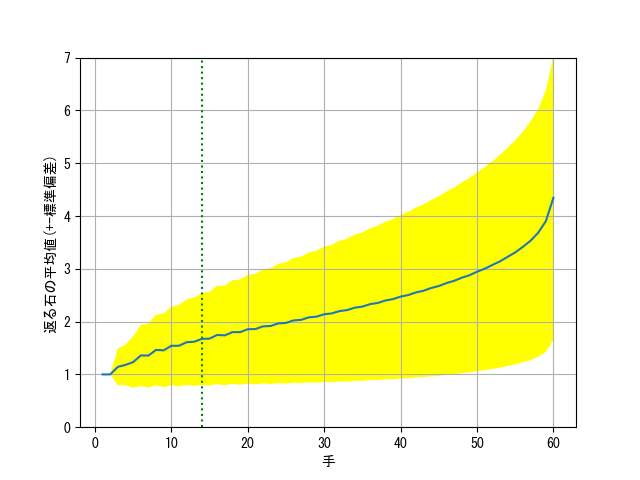

# Count Average Number of Flipped Discs of Othello


codes are copied from [Egaroucid](https://www.egaroucid.nyanyan.dev/)


```
played 10000000 games randomly
0 0 0 0 1 1 1.13337 1.24328
1.227 1.4072 1.35402 1.49578 1.45548 1.57112 1.5375 1.63299
1.61018 1.69125 1.67688 1.74666 1.73951 1.80136 1.79975 1.85637
1.85843 1.91064 1.91686 1.96556 1.9747 2.02236 2.034 2.08053 
2.09335 2.13942 2.1549 2.19987 2.21865 2.26391 2.28474 2.33049
2.35289 2.3998 2.42565 2.4741 2.50251 2.55257 2.58427 2.63648
2.67275 2.72961 2.77011 2.83088 2.87887 2.94505 3.00021 3.07535
3.14233 3.22724 3.30968 3.41489 3.53058 3.68148 3.89986 4.34609
avg 2.24685
```



